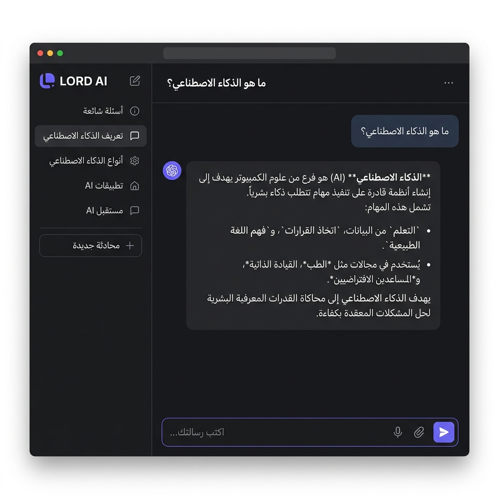

<div align="center">

<br>


<br><br>

# LORD AI

### 🤖 مساعد ذكاء اصطناعي فائق السرعة بتصميم مستقبلي

<p>
<a href="https://lord-ai.pages.dev"></a>
</p>

<p>


</p>

<p align="center">
<sub>واجهة دردشة ذكية مبنية من الصفر بتقنيات الويب الأساسية فقط — بدون أي مكتبات أو أطر عمل.</sub>
<br>
<sub>مستوحاة من أحدث واجهات ChatGPT و Claude مع هوية بصرية فريدة.</sub>
</p>

<br>

[🌐 الموقع المباشر](https://lord-ai.pages.dev) · [🐛 الإبلاغ عن مشكلة](https://github.com/Lord-shaban/lord-ai/issues) · [💡 اقتراح ميزة](https://github.com/Lord-shaban/lord-ai/issues)

---

</div>

<br>

## 📸 لقطات الشاشة

<div align="center">



<sub>واجهة الدردشة في الوضع الداكن — تصميم عصري مستوحى من ChatGPT و Claude</sub>

</div>

<br>

##  &nbsp; نظرة عامة

<br>

> **LORD AI** ليس مجرد واجهة دردشة — بل تجربة متكاملة صُممت لتكون سريعة، أنيقة، وقوية.
> كل سطر كود كُتب بعناية لتقديم تفاعل سلس مع الذكاء الاصطناعي بأداء يفوق التوقعات.

<br>

<div align="center">
<table>
<tr>
<td align="center" width="25%">
<br>

<br><br>
<b>صفر تبعيات</b>
<br>
<sub>Vanilla JS/CSS فقط</sub>
<br><br>
</td>
<td align="center" width="25%">
<br>

<br><br>
<b>نموذج ضخم</b>
<br>
<sub>Llama 3.3 70B</sub>
<br><br>
</td>
<td align="center" width="25%">
<br>

<br><br>
<b>استجابة فورية</b>
<br>
<sub>Groq LPU Engine</sub>
<br><br>
</td>
<td align="center" width="25%">
<br>

<br><br>
<b>مكتبة موسيقية</b>
<br>
<sub>عربي + إنجليزي</sub>
<br><br>
</td>
</tr>
</table>
</div>

<br>

##  &nbsp; المميزات

<br>

<table>
<tr>
<td width="50%" valign="top">

#### 🧠 &nbsp; الذكاء الاصطناعي

- نموذج **Llama 3.3 70B** — أحد أقوى النماذج المفتوحة عالمياً
- **بث الردود** بالوقت الحقيقي كلمة بكلمة (Streaming)
- **اكتشاف تلقائي للغة** — يرد بالعربية أو الإنجليزية تلقائياً
- **System Prompt احترافي** — ردود منظمة مع Markdown كامل
- **معالجة أخطاء ذكية** — رسائل واضحة عند تجاوز الحدود
- **اقتراحات ذكية** بناءً على المزاج والسياق

</td>
<td width="50%" valign="top">

#### 🎨 &nbsp; التصميم والواجهة

- تصميم **رمادي داكن عصري** بهوية بصرية فريدة
- **وضعان للعرض** — داكن وفاتح مع انتقال سلس بالألوان
- **أنيميشن متقدمة** — Orb متحرك، تأثيرات حركية، micro-interactions
- **بطاقات اقتراحات** — نقاط بداية سريعة للمحادثات
- **خطوط احترافية** — Inter, Noto Sans Arabic, JetBrains Mono
- **متجاوب بالكامل** — يعمل على جميع الأجهزة والشاشات

</td>
</tr>
<tr>
<td width="50%" valign="top">

#### 🎵 &nbsp; مشغل الموسيقى المدمج

- **18 أغنية** — عربية كلاسيكية وحديثة + إنجليزية
- **محرك بحث ذكي** — Weighted Scoring System للاختيار الدقيق
- **اقتراح بالمزاج** — حب، حزن، حماس، طرب، هدوء
- **تشغيل متكامل** — Play/Pause, Seek, Progress bar, Timer
- **تحميل مباشر** — زر تنزيل لكل أغنية
- أسماء الفنانين: **أم كلثوم · فيروز · عبد الحليم · Ed Sheeran** والمزيد

</td>
<td width="50%" valign="top">

#### 📊 &nbsp; الإدارة والتحليلات

- **لوحة تحكم أدمن** — مراقبة نشاط جميع المستخدمين
- **تتبع شامل** — زيارات، رسائل، أجهزة، لغات، أداء
- **رسوم بيانية** — نشاط يومي، توزيع اللغات، الأجهزة
- **جدول المستخدمين** — بيانات كل زائر وحالة الاتصال
- **تصدير البيانات** — تحميل كل التحليلات كـ JSON
- **Firebase Firestore** — قاعدة بيانات لحظية سحابية

</td>
</tr>
<tr>
<td width="50%" valign="top">

#### ⚡ &nbsp; الأداء والتجربة

- **صفر مكتبات خارجية** — كل سطر مكتوب يدوياً
- **حفظ تلقائي** — جميع المحادثات محفوظة محلياً في المتصفح
- **محادثات متعددة** — إنشاء، تسمية، وإدارة بلا حدود
- **نسخ فوري** — نسخ الردود والأكواد بضغطة واحدة
- **اختصارات لوحة المفاتيح** — تنقل وإرسال سريع
- **Markdown Parser مدمج** — عرض أكواد وقوائم وجداول

</td>
<td width="50%" valign="top">

#### 🔒 &nbsp; الأمان والخصوصية

- **لا خوادم خلفية** — تطبيق ويب ثابت بالكامل (Static)
- **تخزين محلي** — المحادثات في `localStorage` فقط
- **API مباشر** — الاتصال بـ Groq بدون وسيط
- **بدون تسجيل حسابات** — استخدام فوري بدون بيانات شخصية
- **كود مفتوح المصدر** — شفافية كاملة

</td>
</tr>
</table>

<br>

##  &nbsp; التقنيات

<br>

<div align="center">


</div>

<br>

| التقنية | الدور | التفاصيل |
|:---:|:---|:---|
| **HTML5** | الهيكل | بنية دلالية حديثة مع SEO مُحسّن |
| **CSS3** | التصميم | CSS Variables, Grid, Flexbox, أنيميشن, Dark/Light modes |
| **JavaScript** | المنطق | Vanilla JS — Fetch API, Streaming, Markdown Parser, Music Engine |
| **Firebase** | البيانات | Firestore لتحليلات المستخدمين في الوقت الحقيقي |
| **Groq** | الذكاء | Llama 3.3 70B عبر LPU — استجابة بأجزاء من الثانية |
| **Cloudflare** | الاستضافة | Pages CDN — توزيع عالمي فائق السرعة |

<br>

##  &nbsp; التشغيل المحلي

<br>

### المتطلبات الأساسية

- متصفح ويب حديث (Chrome, Firefox, Safari, Edge)
- مفتاح API من [Groq](https://console.groq.com) (مجاني)
- *(اختياري)* مشروع [Firebase](https://console.firebase.google.com) للتحليلات

### خطوات التثبيت

```bash
# 1. استنساخ المستودع
git clone https://github.com/Lord-shaban/lord-ai.git

# 2. الدخول إلى المجلد
cd lord-ai

# 3. تشغيل خادم محلي (اختر أحد الطرق)

# الطريقة 1: Python
python -m http.server 8080

# الطريقة 2: Node.js
npx serve .

# الطريقة 3: VS Code Live Server Extension
# فقط اضغط "Go Live" في VS Code

# 4. افتح المتصفح على
# http://localhost:8080
```

### إعداد مفتاح API

عدّل ملف `app.js` وضع مفتاح Groq الخاص بك:

```javascript
var API_KEY = 'gsk_YOUR_API_KEY_HERE';
```

### إعداد Firebase (اختياري)

عدّل ملف `firebase-config.js`:

```javascript
var FIREBASE_CONFIG = {
    apiKey: "YOUR_API_KEY",
    authDomain: "your-project.firebaseapp.com",
    projectId: "your-project-id",
    storageBucket: "your-project.appspot.com",
    messagingSenderId: "123456789",
    appId: "1:123456789:web:abcdef"
};
```

<br>

##  &nbsp; النشر على Cloudflare Pages

<br>

```
1. ارفع المشروع إلى GitHub
2. اذهب إلى Cloudflare Dashboard → Pages
3. اربط مستودع GitHub
4. اضبط إعدادات البناء:
   • Build command: (اتركه فارغاً)
   • Build output directory: /
5. انشر! 🚀
```

<br>

##  &nbsp; اختصارات لوحة المفاتيح

<br>

<div align="center">

| الرمز | الاختصار | الوظيفة |
|:---:|:---:|:---|
| ⏎ | `Enter` | إرسال الرسالة |
| ↵ | `Shift` + `Enter` | سطر جديد بدون إرسال |
| ✦ | `Ctrl` + `Shift` + `N` | فتح محادثة جديدة |
| ⌕ | `/` | تركيز حقل الكتابة فوراً |
| ✕ | `Escape` | إغلاق القائمة الجانبية |

</div>

<br>

##  &nbsp; 🎵 مكتبة الموسيقى

<br>

<div align="center">

| # | الأغنية | الفنان | النوع |
|:---:|:---|:---|:---:|
| 1 | Perfect | Ed Sheeran | 🇬🇧 Pop |
| 2 | Never Say Never | Justin Bieber ft. Jaden | 🇬🇧 Motivational |
| 3 | The Winner Takes It All | ABBA | 🇬🇧 Classic |
| 4 | انساك | أم كلثوم | 🇪🇬 طرب |
| 5 | أول مرة | عبد الحليم حافظ | 🇪🇬 طرب |
| 6 | كيفك إنت | فيروز | 🇱🇧 كلاسيك |
| 7 | عيناك | صباح فخري | 🇸🇾 طرب |
| 8 | حلف القمر | جورج وسوف | 🇸🇾 كلاسيك |
| 9 | قمر الزمان | وديع مراد | 🇱🇧 كلاسيك |
| 10 | جيت على بالي | عامر منيب | 🇪🇬 بوب |
| 11 | إن كنت غالي | عايدة الأيوبي | 🇪🇬 عربي |
| 12 | يا الميدان | كايروكي | 🇪🇬 روك |
| 13 | فاكرة | مسار إجباري | 🇪🇬 بديل |
| 14 | تايه في الأماكن | نبيل | 🇪🇬 بوب |
| 15 | حسيني | TUL8TE | 🇪🇬 بوب |
| 16 | كده كفاية | — | 🇪🇬 عربي |
| 17 | اسمعيني بكلمة | — | 🇪🇬 عربي |
| 18 | تشرين | زين عبيد | 🇸🇾 عربي |

</div>

<br>

##  &nbsp; البنية

<br>

```
lord-ai/
│
├── 📄 index.html              ← الواجهة الرئيسية — الدردشة والتفاعل
├── 🎨 style.css               ← نظام التصميم — Dark/Light، المتغيرات، الأنيميشن
├── ⚡ app.js                  ← المحرك — API، Streaming، Markdown، الموسيقى
├── 🔥 firebase-config.js      ← إعدادات Firebase Firestore
├── 📁 assets/
│   ├── 🖼️ banner.png          ← صورة البانر
│   ├── 📁 screenshots/        ← لقطات الشاشة
│   └── 🎵 music/              ← ملفات الأغاني (18 ملف MP3)
├── 🔒 .gitignore              ← ملفات مستثناة من Git
├── 📜 LICENSE                 ← رخصة MIT
├── 📋 CONTRIBUTING.md         ← دليل المساهمة
├── 🔄 CHANGELOG.md            ← سجل التغييرات
├── 🛡️ SECURITY.md             ← سياسة الأمان
├── 🤝 CODE_OF_CONDUCT.md      ← قواعد السلوك
└── 📖 README.md               ← أنت هنا ✨
```

<br>

##  &nbsp; المساهمة

<br>

نرحب بجميع المساهمات! اقرأ [دليل المساهمة](CONTRIBUTING.md) للبدء.

```
1. Fork المشروع
2. أنشئ فرع جديد: git checkout -b feature/amazing-feature
3. أضف تغييراتك: git commit -m 'Add amazing feature'
4. ارفع الفرع: git push origin feature/amazing-feature
5. افتح Pull Request
```

<br>

##  &nbsp; الرخصة

<br>

هذا المشروع مرخص بموجب [رخصة MIT](LICENSE) — يمكنك استخدامه، تعديله، وتوزيعه بحرية.

<br>

---

<div align="center">

<br>


<br><br>

**Built with ❤️ by [Lord Shaban](https://github.com/Lord-shaban)**

<sub>

Powered by **Llama 3.3 70B** · Accelerated by **Groq LPU** · Hosted on **Cloudflare Pages** · © 2026

</sub>

<br>

⭐ **إذا أعجبك المشروع، لا تنسَ تعطيه نجمة!** ⭐

<br><br>

</div>
