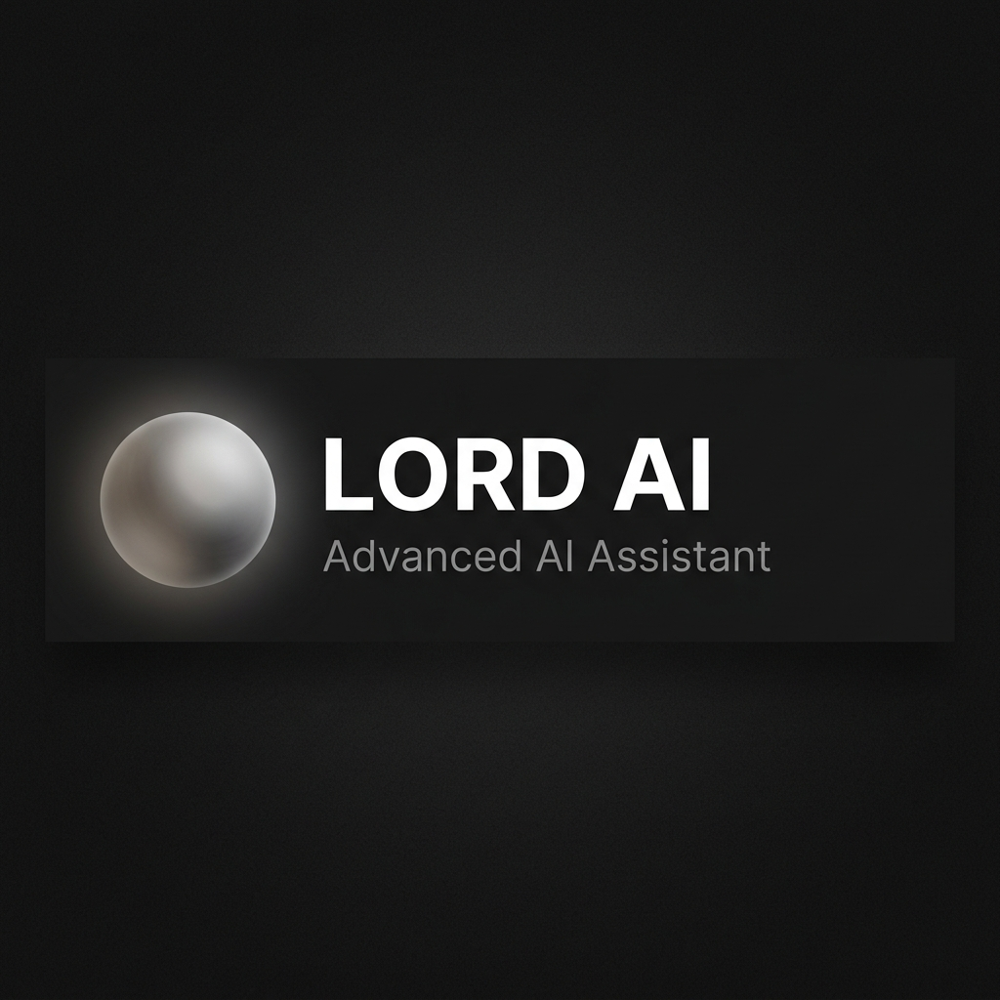
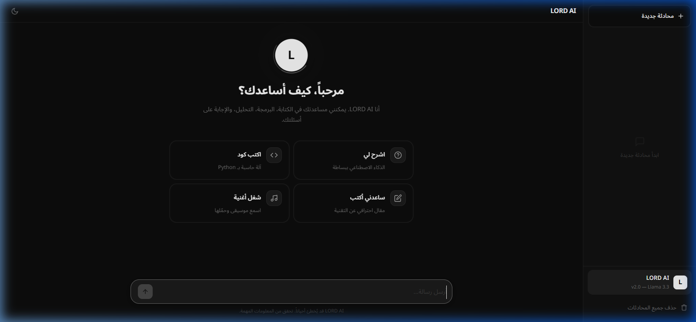
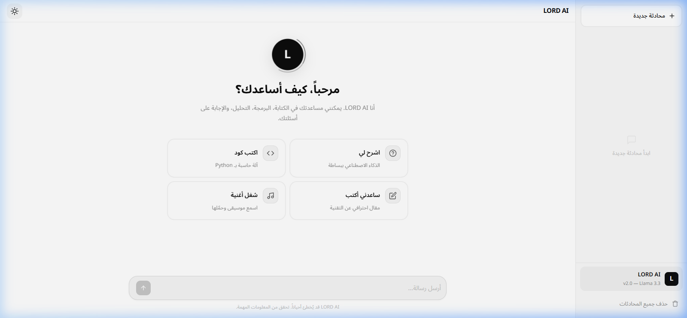
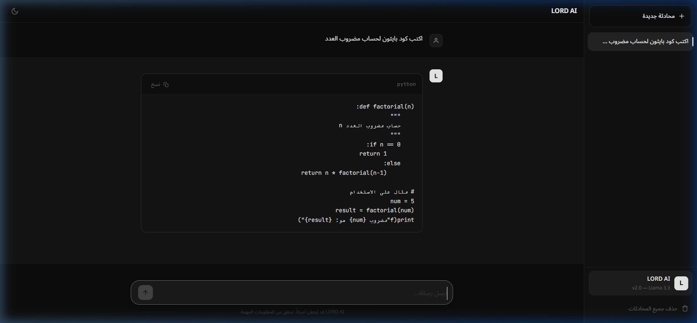
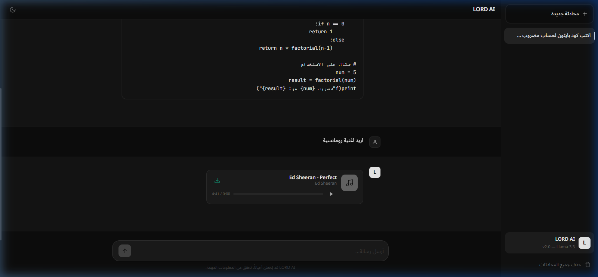

<div align="center">

<br>



<br><br>

<a href="https://lord-ai.pages.dev">

</a>

<br><br>

<p>


</p>

<br>

<h3>مساعد ذكاء اصطناعي فائق السرعة بتصميم مستقبلي ⚡</h3>

<p>
واجهة دردشة ذكية مبنية من الصفر بتقنيات الويب الأساسية فقط — بدون أي مكتبات أو أطر عمل
<br>
مستوحاة من أحدث واجهات ChatGPT و Claude مع هوية بصرية فريدة
</p>

<br>

[🌐 الموقع المباشر](https://lord-ai.pages.dev) &nbsp;·&nbsp; [🐛 الإبلاغ عن مشكلة](https://github.com/Lord-shaban/lord-ai/issues) &nbsp;·&nbsp; [💡 اقتراح ميزة](https://github.com/Lord-shaban/lord-ai/issues)

<br>

---

</div>

<br>

## 📸 &nbsp; لقطات الشاشة

<div align="center">

<table>
<tr>
<td align="center" width="50%">

<br>
<sub><b>🌙 الواجهة الرئيسية</b> — الوضع الداكن مع بطاقات الاقتراحات</sub>
</td>
<td align="center" width="50%">

<br>
<sub><b>☀️ الوضع الفاتح</b> — انتقال سلس بين الأوضاع</sub>
</td>
</tr>
<tr>
<td align="center" width="50%">

<br>
<sub><b>💻 عرض الأكواد</b> — Syntax Highlighting مع زر نسخ</sub>
</td>
<td align="center" width="50%">

<br>
<sub><b>🎵 مشغل الموسيقى</b> — تشغيل مدمج مع التحميل</sub>
</td>
</tr>
</table>

</div>

<br>

##  &nbsp; نظرة عامة

<br>

> **LORD AI** ليس مجرد واجهة دردشة — بل تجربة متكاملة صُممت لتكون سريعة، أنيقة، وقوية.
> كل سطر كود كُتب بعناية لتقديم تفاعل سلس مع الذكاء الاصطناعي بأداء يفوق التوقعات.

<br>

<div align="center">
<table>
<tr>
<td align="center" width="25%">
<br>

<br><br>
<b>صفر تبعيات</b>
<br>
<sub>Vanilla JS/CSS فقط</sub>
<br><br>
</td>
<td align="center" width="25%">
<br>

<br><br>
<b>نموذج ضخم</b>
<br>
<sub>Llama 3.3 70B</sub>
<br><br>
</td>
<td align="center" width="25%">
<br>

<br><br>
<b>استجابة فورية</b>
<br>
<sub>Groq LPU Engine</sub>
<br><br>
</td>
<td align="center" width="25%">
<br>

<br><br>
<b>مكتبة موسيقية</b>
<br>
<sub>عربي + إنجليزي</sub>
<br><br>
</td>
</tr>
</table>
</div>

<br>

##  &nbsp; المميزات

<br>

<table>
<tr>
<td width="50%" valign="top">

#### 🧠 &nbsp; الذكاء الاصطناعي

- نموذج **Llama 3.3 70B** — أحد أقوى النماذج المفتوحة عالمياً
- **بث الردود** بالوقت الحقيقي كلمة بكلمة (Streaming)
- **اكتشاف تلقائي للغة** — يرد بالعربية أو الإنجليزية تلقائياً
- **System Prompt احترافي** — ردود منظمة مع Markdown كامل
- **معالجة أخطاء ذكية** — رسائل واضحة عند تجاوز الحدود
- **اقتراحات ذكية** بناءً على المزاج والسياق

</td>
<td width="50%" valign="top">

#### 🎨 &nbsp; التصميم والواجهة

- تصميم **رمادي داكن عصري** بهوية بصرية فريدة
- **وضعان للعرض** — داكن وفاتح مع انتقال سلس بالألوان
- **أنيميشن متقدمة** — Orb متحرك، تأثيرات حركية، micro-interactions
- **بطاقات اقتراحات** — نقاط بداية سريعة للمحادثات
- **خطوط احترافية** — Inter, Noto Sans Arabic, JetBrains Mono
- **متجاوب بالكامل** — يعمل على جميع الأجهزة والشاشات

</td>
</tr>
<tr>
<td width="50%" valign="top">

#### 🎵 &nbsp; مشغل الموسيقى المدمج

- **18 أغنية** — عربية كلاسيكية وحديثة + إنجليزية
- **محرك بحث ذكي** — Weighted Scoring System للاختيار الدقيق
- **اقتراح بالمزاج** — حب، حزن، حماس، طرب، هدوء
- **تشغيل متكامل** — Play/Pause, Seek, Progress bar, Timer
- **تحميل مباشر** — زر تنزيل لكل أغنية
- أسماء الفنانين: **أم كلثوم · فيروز · عبد الحليم · Ed Sheeran** والمزيد

</td>
<td width="50%" valign="top">

#### 📊 &nbsp; الإدارة والتحليلات

- **لوحة تحكم أدمن** — مراقبة نشاط جميع المستخدمين
- **تتبع شامل** — زيارات، رسائل، أجهزة، لغات، أداء
- **رسوم بيانية تفاعلية** — نشاط يومي، توزيع اللغات، الأجهزة
- **جدول المستخدمين** — بيانات كل زائر وحالة الاتصال
- **تصدير البيانات** — تحميل كل التحليلات كـ JSON
- **Firebase Firestore** — قاعدة بيانات لحظية سحابية

</td>
</tr>
<tr>
<td width="50%" valign="top">

#### ⚡ &nbsp; الأداء والتجربة

- **صفر مكتبات خارجية** — كل سطر مكتوب يدوياً
- **حفظ تلقائي** — جميع المحادثات محفوظة في `localStorage`
- **محادثات متعددة** — إنشاء، تسمية، وإدارة بلا حدود
- **نسخ فوري** — نسخ الردود والأكواد بضغطة واحدة
- **اختصارات لوحة المفاتيح** — تنقل وإرسال سريع
- **Markdown Parser مدمج** — أكواد، قوائم، جداول، روابط

</td>
<td width="50%" valign="top">

#### 🔒 &nbsp; الأمان والخصوصية

- **لا خوادم خلفية** — تطبيق ويب ثابت بالكامل (Static)
- **تخزين محلي** — المحادثات في المتصفح فقط
- **API مباشر** — الاتصال بـ Groq بدون وسيط
- **بدون تسجيل حسابات** — استخدام فوري بدون بيانات شخصية
- **كود مفتوح المصدر** — شفافية كاملة ورخصة MIT

</td>
</tr>
</table>

<br>

##  &nbsp; التقنيات المستخدمة

<br>

<div align="center">


</div>

<br>

| التقنية | الدور | التفاصيل |
|:---:|:---|:---|
| **HTML5** | الهيكل | بنية دلالية حديثة مع SEO مُحسّن |
| **CSS3** | التصميم | CSS Variables, Grid, Flexbox, Animations, Dark/Light |
| **JavaScript** | المنطق | Vanilla JS — Fetch API, Streaming, Markdown, Music Engine |
| **Firebase** | البيانات | Firestore لتحليلات المستخدمين في الوقت الحقيقي |
| **Groq** | الذكاء | Llama 3.3 70B عبر LPU — استجابة بأجزاء من الثانية |
| **Cloudflare** | الاستضافة | Pages CDN — توزيع عالمي فائق السرعة |

<br>

##  &nbsp; التشغيل المحلي

<br>

### المتطلبات

- متصفح ويب حديث (Chrome, Firefox, Safari, Edge)
- مفتاح API من [Groq](https://console.groq.com) *(مجاني)*
- *(اختياري)* مشروع [Firebase](https://console.firebase.google.com) للتحليلات

### التثبيت

```bash
# استنساخ المستودع
git clone https://github.com/Lord-shaban/lord-ai.git
cd lord-ai

# تشغيل خادم محلي (اختر أي طريقة)
python -m http.server 8080     # Python
npx serve .                    # Node.js
# أو استخدم VS Code Live Server

# افتح المتصفح
# → http://localhost:8080
```

### الإعداد

```javascript
// app.js — ضع مفتاح Groq الخاص بك
var API_KEY = 'gsk_YOUR_API_KEY_HERE';
```

```javascript
// firebase-config.js — (اختياري) للتحليلات
var FIREBASE_CONFIG = {
    apiKey: "YOUR_KEY",
    projectId: "your-project-id",
    // ...
};
```

<br>

##  &nbsp; النشر

<br>

<div align="center">

| الخطوة | التفاصيل |
|:---:|:---|
| **1** | ارفع المشروع إلى GitHub |
| **2** | اذهب إلى **Cloudflare Dashboard** → **Pages** |
| **3** | اربط مستودع GitHub |
| **4** | Build command: *(اتركه فارغاً)* &nbsp;&nbsp;·&nbsp;&nbsp; Output: `/` |
| **5** | **انشر!** 🚀 |

</div>

<br>

##  &nbsp; اختصارات لوحة المفاتيح

<br>

<div align="center">

| الرمز | الاختصار | الوظيفة |
|:---:|:---:|:---|
| ⏎ | `Enter` | إرسال الرسالة |
| ↵ | `Shift + Enter` | سطر جديد بدون إرسال |
| ✦ | `Ctrl + Shift + N` | فتح محادثة جديدة |
| ⌕ | `/` | تركيز حقل الكتابة |
| ✕ | `Escape` | إغلاق القائمة الجانبية |

</div>

<br>

##  &nbsp; 🎵 المكتبة الموسيقية

<br>

<details>
<summary><b>عرض قائمة الأغاني الـ 18 كاملة</b></summary>

<br>

<div align="center">

| # | الأغنية | الفنان | النوع |
|:---:|:---|:---|:---:|
| 1 | Perfect | Ed Sheeran | 🇬🇧 Pop |
| 2 | Never Say Never | Justin Bieber ft. Jaden | 🇬🇧 Motivational |
| 3 | The Winner Takes It All | ABBA | 🇬🇧 Classic |
| 4 | انساك | أم كلثوم | 🇪🇬 طرب |
| 5 | أول مرة | عبد الحليم حافظ | 🇪🇬 طرب |
| 6 | كيفك إنت | فيروز | 🇱🇧 كلاسيك |
| 7 | عيناك | صباح فخري | 🇸🇾 طرب |
| 8 | حلف القمر | جورج وسوف | 🇸🇾 كلاسيك |
| 9 | قمر الزمان | وديع مراد | 🇱🇧 كلاسيك |
| 10 | جيت على بالي | عامر منيب | 🇪🇬 بوب |
| 11 | إن كنت غالي | عايدة الأيوبي | 🇪🇬 عربي |
| 12 | يا الميدان | كايروكي | 🇪🇬 روك |
| 13 | فاكرة | مسار إجباري | 🇪🇬 بديل |
| 14 | تايه في الأماكن | نبيل | 🇪🇬 بوب |
| 15 | حسيني | TUL8TE | 🇪🇬 بوب |
| 16 | كده كفاية | — | 🇪🇬 عربي |
| 17 | اسمعيني بكلمة | — | 🇪🇬 عربي |
| 18 | تشرين | زين عبيد | 🇸🇾 عربي |

</div>

</details>

<br>

##  &nbsp; بنية المشروع

<br>

```
lord-ai/
│
├── 📄 index.html              ← الواجهة الرئيسية
├── 🎨 style.css               ← نظام التصميم الكامل
├── ⚡ app.js                  ← المحرك الأساسي
├── 🔥 firebase-config.js      ← إعدادات Firebase
│
├── 📁 assets/
│   ├── 🖼️ banner.png          ← بانر المشروع
│   ├── 📁 screenshots/        ← لقطات الشاشة
│   └── 🎵 music/              ← 18 ملف MP3
│
├── 📁 .github/
│   ├── 📁 ISSUE_TEMPLATE/     ← قوالب Issues
│   └── 📋 PULL_REQUEST_TEMPLATE.md
│
├── 📖 README.md               ← أنت هنا ✨
├── 📋 CONTRIBUTING.md         ← دليل المساهمة
├── 🔄 CHANGELOG.md            ← سجل التغييرات
├── 🛡️ SECURITY.md             ← سياسة الأمان
├── 🤝 CODE_OF_CONDUCT.md      ← قواعد السلوك
├── 📜 LICENSE                 ← رخصة MIT
└── 🔒 .gitignore
```

<br>

##  &nbsp; المساهمة

<br>

نرحب بجميع المساهمات! اقرأ [دليل المساهمة](CONTRIBUTING.md) للبدء.

```bash
# 1. Fork المشروع
# 2. أنشئ فرع: git checkout -b feature/awesome
# 3. Commit: git commit -m 'feat: add awesome feature'
# 4. Push: git push origin feature/awesome
# 5. افتح Pull Request
```

<br>

##  &nbsp; الرخصة

<br>

هذا المشروع مرخص بموجب **[رخصة MIT](LICENSE)** — يمكنك استخدامه، تعديله، وتوزيعه بحرية.

<br>

---

<div align="center">

<br>

### 👨‍💻 المطور

<a href="https://github.com/Lord-shaban">

</a>

<br><br>

**[Ahmed Sha'ban](https://github.com/Lord-shaban)**

<sub>Software Engineer · Nile University Student · Flutter & Firebase Developer</sub>

<br><br>

<a href="https://github.com/Lord-shaban">

</a>

<br><br>

---

<br>


<br><br>

<sub>

Powered by **Llama 3.3 70B** · Accelerated by **Groq LPU** · Hosted on **Cloudflare Pages** · © 2026

</sub>

<br>

⭐ **إذا أعجبك المشروع، لا تنسَ تعطيه نجمة!** ⭐

<br><br>

</div>
