<div align="center">

<br>


<br><br>

<a href="https://lord-ai.pages.dev">

</a>

<br><br>

<p>


</p>

<br>

<h3>مساعد ذكاء اصطناعي عربي — دردشة · موسيقى · أفلام · ١٨ لعبة داخل الشات</h3>

<p>
واجهة RTL أنيقة مبنية من الصفر بتقنيات الويب الأساسية فقط — <b>بدون أي مكتبة أو أداة بناء</b>.
<br>
هوية «Calm Sage» بثيمين فاتح/غامق، وكل حاجة بتشتغل جوه الشات نفسه.
</p>

<br>

[الموقع المباشر](https://lord-ai.pages.dev) &nbsp;·&nbsp; [الإبلاغ عن مشكلة](https://github.com/Lord-shaban/lord-ai/issues) &nbsp;·&nbsp; [اقتراح ميزة](https://github.com/Lord-shaban/lord-ai/issues) &nbsp;·&nbsp; [سجل التغييرات](CHANGELOG.md)

<br>

---

</div>

<br>

##  &nbsp; لقطات الشاشة

<div align="center">

<table>
<tr>
<td align="center" width="50%">
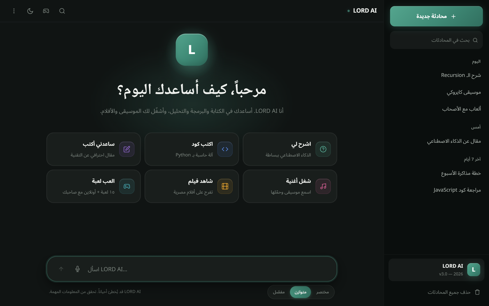
<br><sub><b>الوضع الداكن</b> — شاشة الترحيب وبطاقات البدء</sub>
</td>
<td align="center" width="50%">
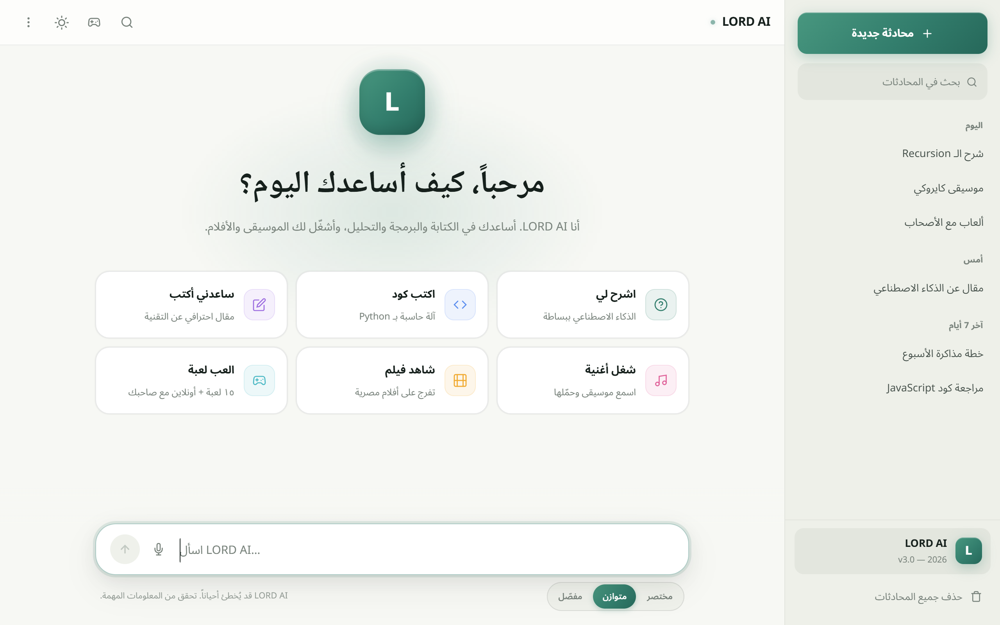
<br><sub><b>الوضع الفاتح</b> — نفس الهوية بروح فاتحة</sub>
</td>
</tr>
<tr>
<td align="center" width="50%">
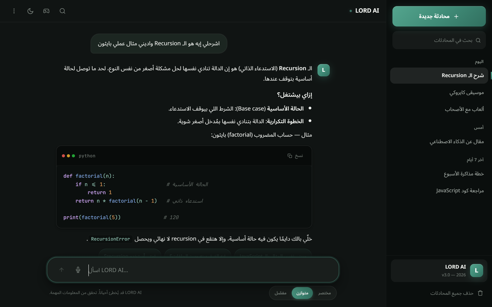
<br><sub><b>الأكواد</b> — تلوين صياغة + زر نسخ + Markdown كامل</sub>
</td>
<td align="center" width="50%">
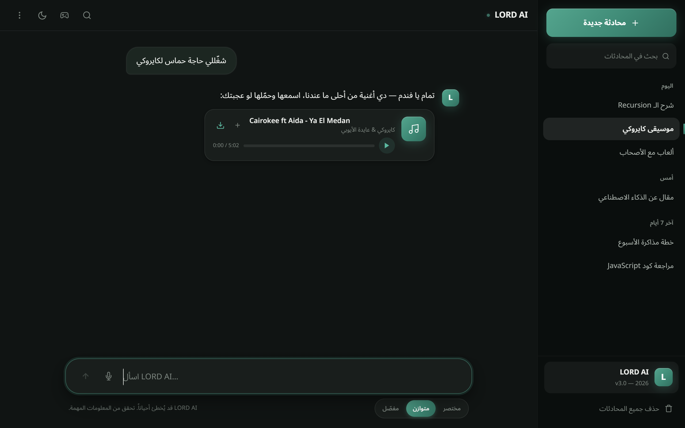
<br><sub><b>مشغل الموسيقى</b> — تشغيل وتحميل داخل الرسالة</sub>
</td>
</tr>
<tr>
<td align="center" width="50%">
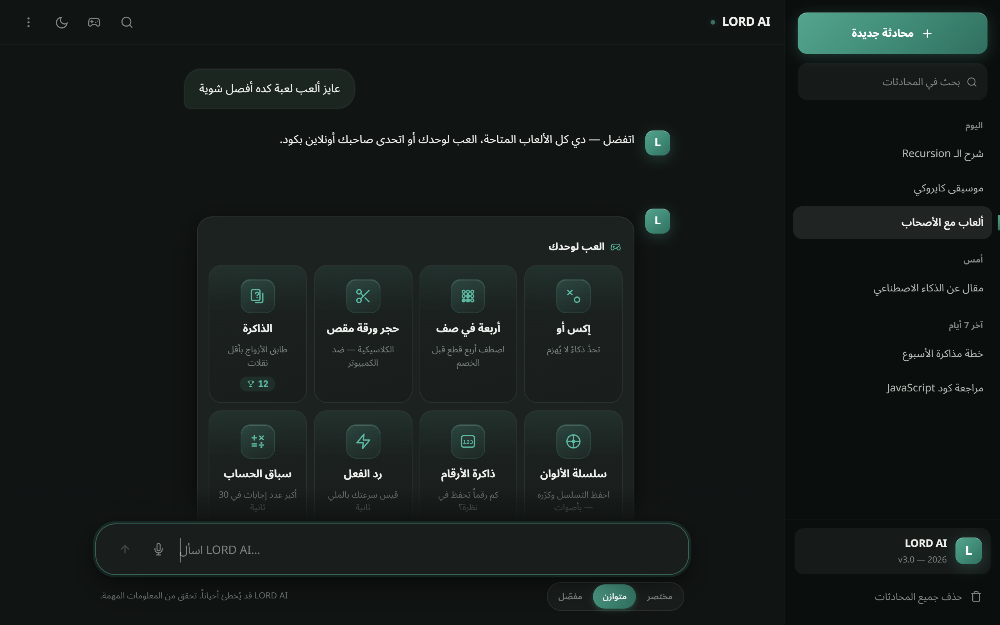
<br><sub><b>هَب الألعاب</b> — ١٥ لعبة سولو + ٣ أونلاين</sub>
</td>
<td align="center" width="50%">
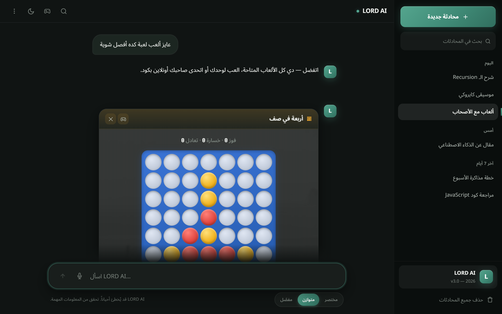
<br><sub><b>ألعاب احترافية</b> — قطع لامعة تُلعب جوه الشات</sub>
</td>
</tr>
</table>

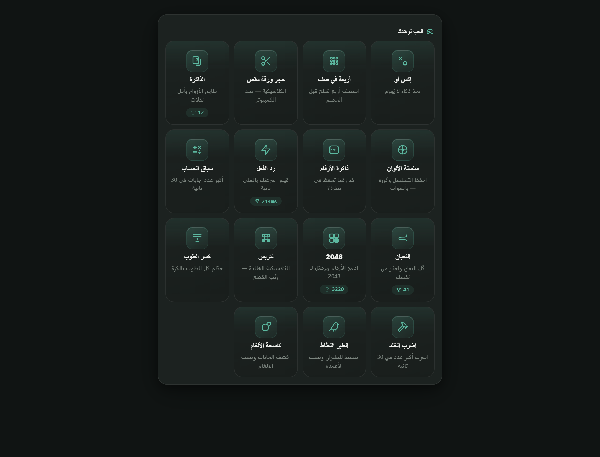
<br><sub><b>مكتبة الألعاب كاملة</b> — أيقونات SVG مخصصة بدون أي إيموجي</sub>

<br><br>

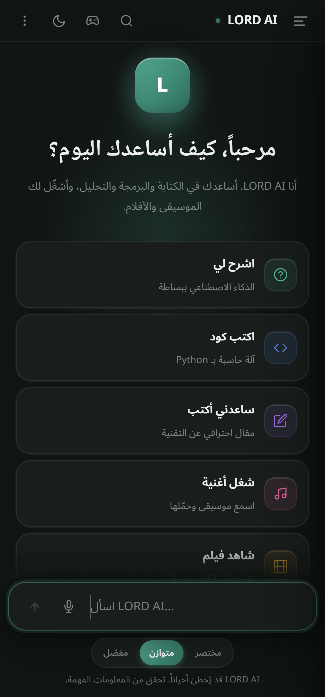
&nbsp;&nbsp;
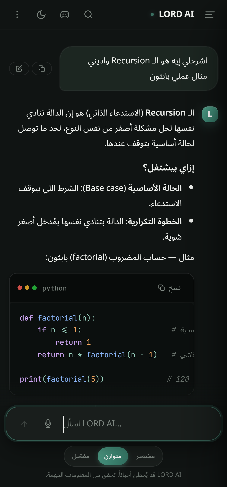
&nbsp;&nbsp;
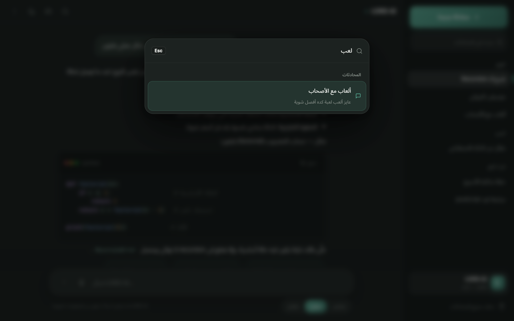
<br><sub><b>متجاوب بالكامل</b> — درج جانبي وأهداف لمس مريحة &nbsp;·&nbsp; <b>لوحة أوامر</b> (Ctrl + K)</sub>

</div>

<br>

##  &nbsp; نظرة عامة

<br>

> **LORD AI** مش مجرد واجهة دردشة — ده مساعد متكامل عربي أولًا، بيرد بالعامية المصرية، بيشغّل موسيقى وأفلام، وبيلعب معاك ألعاب حقيقية جوه الشات. كل ده في تطبيق ويب ثابت (Static) بدون سيرفر خلفي وبدون أي مكتبة خارجية.

<br>

<div align="center">
<table>
<tr>
<td align="center" width="20%">
<br><br><br>
<b>صفر تبعيات</b><br><sub>Vanilla JS/CSS</sub><br><br>
</td>
<td align="center" width="20%">
<br><br><br>
<b>أغنية</b><br><sub>عربي + إنجليزي</sub><br><br>
</td>
<td align="center" width="20%">
<br><br><br>
<b>فيلم</b><br><sub>مشغّل مدمج</sub><br><br>
</td>
<td align="center" width="20%">
<br><br><br>
<b>لعبة</b><br><sub>١٥ سولو + ٣ أونلاين</sub><br><br>
</td>
<td align="center" width="20%">
<br><br><br>
<b>ثيم</b><br><sub>فاتح + غامق</sub><br><br>
</td>
</tr>
</table>
</div>

<br>

##  &nbsp; المميزات

<br>

<table>
<tr>
<td width="50%" valign="top">

#### الذكاء الاصطناعي

- نموذج **Gemini 3.1 Flash Lite** عبر واجهة متوافقة مع OpenAI
- **بث الردود** لحظيًا كلمة بكلمة (SSE Streaming)
- **عربي أولًا** — يرد بالعامية المصرية ويكتشف اللغة تلقائيًا
- **برومبت مُوفِّر للتوكنز** — أدلة الموسيقى/الأفلام تُلحق عند الحاجة فقط
- **اقتراحات متابعة** ذكية تحت كل رد
- **عناوين محادثات ذكية** تُولَّد تلقائيًا بعد أول رد

</td>
<td width="50%" valign="top">

#### التصميم والواجهة

- هوية **«Calm Sage»** خضراء عميقة بثيمين فاتح/غامق
- **زجاجية وعمق** — توب بار شفاف، ظلال غنية، تدرجات
- **بدون أي إيموجي في الواجهة** — أيقونات SVG مخصوصة بالكامل
- **RTL/LTR** كامل بخصائص منطقية (logical properties)
- دعم **safe-area** للآيفون (النوتش والهوم)
- **micro-interactions** ونقلات ناعمة في كل مكان

</td>
</tr>
<tr>
<td width="50%" valign="top">

#### موسيقى وأفلام داخل الشات

- **٨٨ أغنية** — كلاسيك وحديث، عربي وإنجليزي (تُستضاف على R2)
- **٥٦ فيلم** — مشغّل مدمج (Google Drive / YouTube)
- مشغّل موسيقى مدمج: تشغيل/إيقاف، Seek، تحميل مباشر
- **بلايليست عائمة** مع تكرار وتشغيل الكل
- مطابقة ذكية بالاسم أو المزاج (حب/حزن/حماس/طرب/هدوء)

</td>
<td width="50%" valign="top">

#### تجربة استخدام 2026

- **لوحة أوامر** (Ctrl + K) — بحث نصي كامل داخل الرسائل
- **تخصيص LORD AI** — اسمك ومعلوماتك وأسلوب الرد
- **أنماط رد** (مختصر/متوازن/مفصّل) وحجم خط قابل للتعديل
- **محادثة مؤقتة** (Incognito) لا تُحفظ أبدًا
- تثبيت، إعادة تسمية، تراجع عن الحذف، تصدير، اقتباس النص
- إدخال صوتي (Web Speech) وقراءة الردود صوتيًا

</td>
</tr>
</table>

<br>

##  &nbsp; الألعاب

<br>

كل لعبة بتترندر **جوه رسالة في الشات** (زي مشغّل الموسيقى) — من غير أي مودال. أيقونات SVG مخصوصة، لوحات بتدرجات ولمعة، وأنيميشن احتفالي عند الفوز.

<div align="center">

| العب لوحدك (١٥) | | | |
|:---|:---|:---|:---|
| إكس أو *(ذكاء لا يُهزم)* | أربعة في صف | حجر ورقة مقص | الذاكرة |
| سلسلة الألوان *(بأصوات)* | ذاكرة الأرقام | رد الفعل | سباق الحساب |
| الثعبان | 2048 | تتريس *(بـ ghost piece)* | كسر الطوب |
| اضرب الخلد | الطير النطاط | كاسحة الألغام | |

</div>

> **أونلاين مع صاحبك:** إكس أو · أربعة في صف · حجر ورقة مقص — يعمل روم بكود شكله `G-ABCD`، صاحبك يكتب الكود في شاته، واللعبة تتزامن لحظيًا عبر Firestore.

<br>

##  &nbsp; الموثوقية وتوفير الحدود

<br>

المفتاح المجاني لـ Gemini مشترك بين كل الزوار، فالمشروع بيحمي نفسه على مستويين:

- **ليميتر لكل مستخدم** (محفوظ محليًا، يتصفّر بعد منتصف الليل): سقف بالدقيقة وسقف يومي لكل متصفح، مع تحذير مبكر قبل النهاية والنص بيفضل في الصندوق لو اتحظر.
- **مجمع مفاتيح مع Failover تلقائي**: أي خطأ 429/quota على مفتاح → إعادة المحاولة فورًا بالمفتاح التالي بشفافية، وآخر مفتاح شغال يُحفظ للجلسات الجاية.

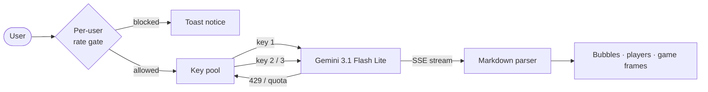

<br>

##  &nbsp; التقنيات

<br>

<div align="center">


</div>

<br>

| الطبقة | التقنية | التفاصيل |
|:---:|:---|:---|
| الواجهة | **HTML5 + CSS3** | نظام تصميم مبني على CSS Variables · Grid/Flex · ثيمين · RTL منطقي |
| المنطق | **Vanilla JS** | IIFE واحد، بدون build — Fetch/SSE، Markdown، محرك موسيقى/ألعاب |
| الذكاء | **Gemini 3.1 Flash Lite** | Google AI عبر endpoint متوافق مع OpenAI |
| البيانات | **Firebase Firestore** | تحليلات لحظية + غرف الألعاب الأونلاين (`lord_rooms`) |
| الميديا | **Cloudflare R2** | استضافة ملفات MP3 بأسماء نظيفة |
| الاستضافة | **Cloudflare Pages** | CDN عالمي فائق السرعة، نشر مباشر من GitHub |

<br>

##  &nbsp; بنية المشروع

<br>

```
lord-ai/
│
├── index.html            ← واجهة الشات (RTL) — Firebase + games.js + app.js
├── app.js                ← كل منطق الشات (IIFE واحد، ~2900 سطر)
├── games.js              ← موديول الألعاب داخل الشات (18 لعبة، window.LordGames)
├── style.css             ← نظام التصميم الكامل "Calm Sage Evolved"
├── x7admin.html          ← لوحة الأدمن والتحليلات (مستقلة تمامًا)
├── firebase-config.js    ← إعدادات Firebase
│
├── assets/
│   ├── banner.svg        ← البانر (بستايل التيرمنال)
│   ├── shots/            ← لقطات الشاشة
│   └── music/            ← ملفات MP3
│
├── README.md · CHANGELOG.md · CONTRIBUTING.md · SECURITY.md · LICENSE
└── .github/              ← قوالب Issues و PR
```

<br>

##  &nbsp; التشغيل المحلي

<br>

المشروع ملفات ثابتة — تقدر تفتح `index.html` مباشرة، أو تشغّل خادم بسيط:

```bash
git clone https://github.com/Lord-shaban/lord-ai.git
cd lord-ai

# أي خادم ثابت (اختر واحد)
python -m http.server 8080     # Python
npx serve .                    # Node.js
# → http://localhost:8080
```

**الإعداد** — ضع مفاتيحك في `app.js` (يدعم أكثر من مفتاح لتوزيع الحدث):

```javascript
// app.js — مجمع مفاتيح Gemini (يفضّل أن تكون من مشاريع Google مختلفة)
var API_KEYS = [
    'YOUR_GEMINI_KEY_1',
    'YOUR_GEMINI_KEY_2'
];
```

```javascript
// firebase-config.js — (اختياري) للتحليلات والألعاب الأونلاين
var FIREBASE_CONFIG = { apiKey: "…", projectId: "…" /* … */ };
```

> **بعد أي تعديل:** `node --check app.js` و `node --check games.js` للتأكد من سلامة الصياغة.

<br>

##  &nbsp; النشر على Cloudflare Pages

<br>

<div align="center">

| الخطوة | التفاصيل |
|:---:|:---|
| **1** | ارفع المشروع إلى GitHub |
| **2** | **Cloudflare Dashboard** → **Workers & Pages** → **Create** → **Pages** |
| **3** | اربط مستودع GitHub |
| **4** | Build command: *(فارغ)* &nbsp;·&nbsp; Output directory: `/` |
| **5** | **Deploy** — ومبروك الموقع أونلاين |

</div>

<br>

##  &nbsp; اختصارات لوحة المفاتيح

<br>

<div align="center">

| الاختصار | الوظيفة | | الاختصار | الوظيفة |
|:---:|:---|:---:|:---:|:---|
| `Enter` | إرسال الرسالة | | `Ctrl + K` | لوحة الأوامر والبحث |
| `Shift + Enter` | سطر جديد | | `Ctrl + G` | فتح الألعاب |
| `Ctrl + Shift + N` | محادثة جديدة | | `Ctrl + /` | عرض الاختصارات |
| `/` | التركيز على الكتابة | | `Esc` | إغلاق / رجوع |

</div>

<br>

##  &nbsp; المكتبة الموسيقية

<br>

<details>
<summary><b>عيّنة من الكتالوج (٨٨ أغنية كاملة داخل التطبيق)</b></summary>

<br>

| الأغنية | الفنان | | الأغنية | الفنان |
|:---|:---|:---:|:---|:---|
| Perfect | Ed Sheeran | | انساك | أم كلثوم |
| The Winner Takes It All | ABBA | | أول مرة | عبد الحليم حافظ |
| Never Say Never | Justin Bieber | | كيفك إنت | فيروز |
| يا الميدان | كايروكي وعايدة | | عيناك | صباح فخري |
| جيت على بالي | عامر منيب | | حلف القمر | جورج وسوف |
| فاكرة | مسار إجباري | | إن كنت غالي | عايدة الأيوبي |

<sub>الكتالوج الكامل معرّف في أول `app.js` (مصفوفة `MUSIC`)، وكل الملفات على Cloudflare R2.</sub>

</details>

<br>

##  &nbsp; المساهمة والرخصة

<br>

المساهمات مرحّب بيها — اقرأ [دليل المساهمة](CONTRIBUTING.md) و [قواعد السلوك](CODE_OF_CONDUCT.md).

```bash
# 1. Fork  →  2. فرع جديد: git checkout -b feature/awesome
# 3. Commit  →  4. Push  →  5. افتح Pull Request
```

هذا المشروع مرخّص تحت **[رخصة MIT](LICENSE)** — استخدمه وعدّله ووزّعه بحرية.

<br>

---

<div align="center">

<br>

### المطوّر

<a href="https://github.com/Lord-shaban">

</a>

<br><br>

**[Ahmed Sha'ban](https://github.com/Lord-shaban)**

<sub>Software Engineer · Nile University · Flutter &amp; Firebase Developer</sub>

<br><br>

<a href="https://github.com/Lord-shaban">

</a>

<br><br>

---

<br>

<sub>مبني بـ **Vanilla JS** · مدعوم بـ **Gemini 3.1 Flash Lite** · مستضاف على **Cloudflare Pages** · © 2026</sub>

<br>

**لو المشروع عجبك، متنساش تديله نجمة ⭐**

<br><br>

</div>
